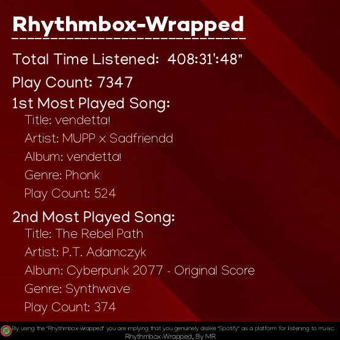
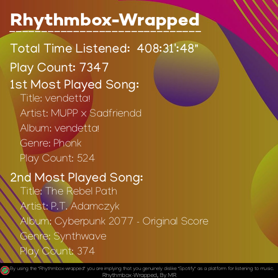
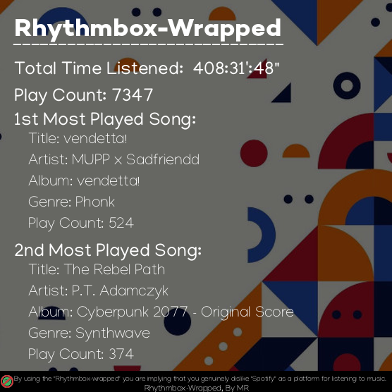

# Rhythmbox-Wrapped

This small script lets you create a summary of how you've been using the program [Rhythmbox](http://www.rhythmbox.org/) on your computer. This script takes the Rhythmbox program data as inputs and creates an image displaying some information, such as:
* How long you've been listening to music with Rhythmbox
* How many songs have you been listening on Rhythmbox
* What are the first and second most listened song on your playlist in Rhythmbox

## Installation

* Download the code or clone the repository
```
$ git clone https://github.com/1MahdiR/Rhythmbox-Wrapped
```
* Enter the repo's directory
```
$ cd Rhythmbox-Wrapped
```
* Install the [pillow](https://python-pillow.org/) python library
```
Rhythmbox-Wrapped$ pip3 install pillow
```
* Run the script `main.py`
```
$ python3 main.py
```
* Your output image is saved as `Rhythmbox-Wrapped.png`

## Examples


<br />

<br />

<br />

## Keep in mind

Please keep in mind, by using the "Rhythmbox-wrapped" you are implying that you genuinely dislike "Spotify" as a platform for listening to music. This project is motivated by the belief that the people who are responsible for Spotify are abusing their influence on users and they are making inconvinient changes to the their services.

## Contact
- [Mahdi-R](https://github.com/1MahdiR) : a.m.rasouli.n@gmail.com
- [Linkedin](https://www.linkedin.com/in/amir-mahdi-rasouli-39566a143/)

## Contributing

Contributions are what make the open source community such an amazing place to learn, inspire, and create. Any contributions you make are **greatly appreciated**.

1. Fork the Project
2. Create your Feature Branch (`git checkout -b feature/AmazingFeature`)
3. Commit your Changes (`git commit -m 'Add some AmazingFeature'`)
4. Push to the Branch (`git push origin feature/AmazingFeature`)
5. Open a Pull Request
